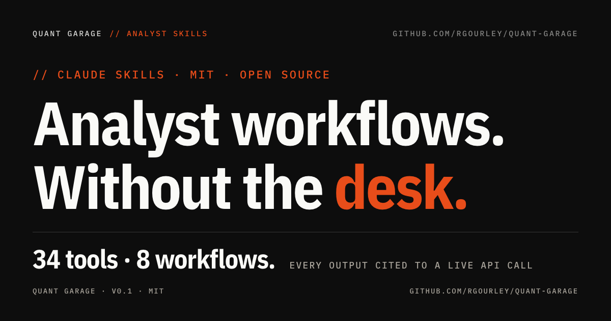
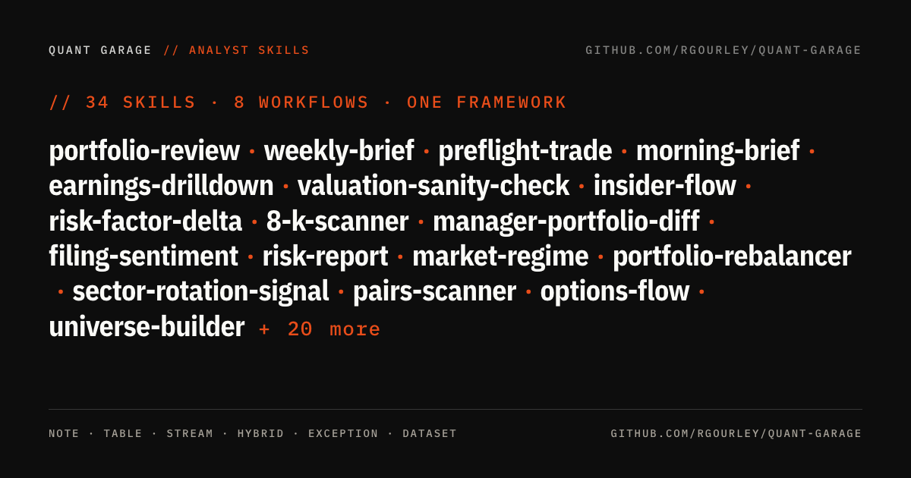
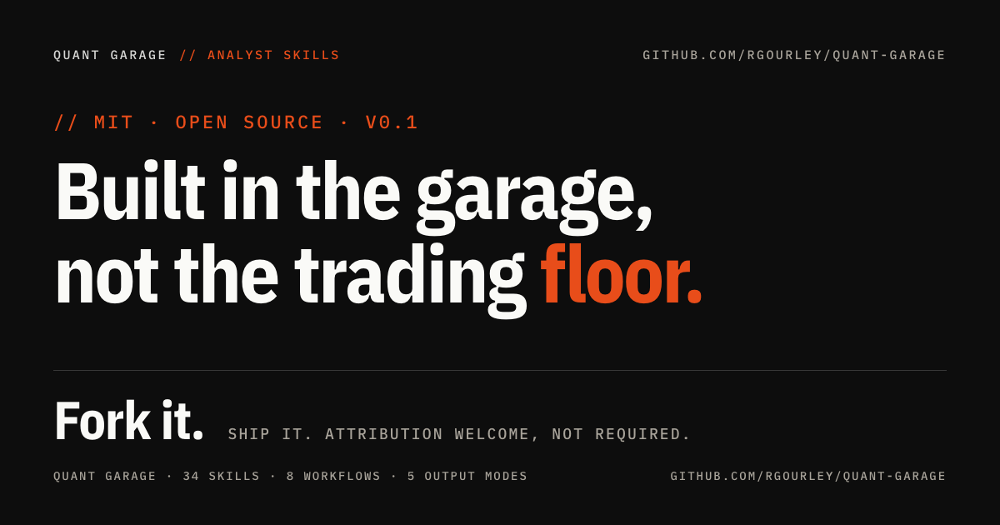

# Quant Garage



Quant and equity research tools that run inside Claude, or behind your
own UI. You ask Claude "preview NVDA earnings" or "screen for momentum
names that pulled back this week" and you get back what a sell-side
analyst would write at 6am, with the supporting numbers and citations
to the API calls underneath.

Or you skip Claude entirely. `pip install quant-garage` and call the
same tool from your own code. Every skill is an importable Python
function that returns JSON, so it drops straight into a Jupyter
notebook, a research dashboard, a Slack alert, a cron job. Both paths
work because every skill ships the same compute as two layers: the
JSON contract for developers and a rendered note, table, stream, or
report for humans.

Thirty-four tools plus eight one-command workflows. One framework.
Built in the garage, not the trading floor.

**Needs a [Massive API key](https://massive.com/pricing).** Free Basic
tier runs twelve of the tools plus most workflows end-to-end; $29/month
Stocks Starter opens thirty-two of the thirty-four tools and every
workflow.

**Feedback welcome.** Found a bug or have an idea? Open an
[issue](https://github.com/rgourley/quant-garage/issues) or send a
[pull request](https://github.com/rgourley/quant-garage/pulls).

## What the collection does

Each tool is useful on its own. The point of having thirty-four that
share data, methodology, and audit trail is that they chain. The
eight workflows show what that chaining looks like when someone
wires the pieces together for a specific cadence.

Tuesday morning, you're long NVDA into Thursday's print.
`earnings-drilldown` shows the implied move is rich vs the 8-quarter
realized. `valuation-sanity-check --mc` puts the current price at the
78th percentile of peer-driven fair values. You like the setup but
want to size honestly. `position-sizer` puts NVDA at 8% under
vol-target given the 48% realized vol. You execute. `portfolio-mark`
walks the snapshot fallback chain; `slippage-cost` flags one fill that
crossed the spread. End of day: `risk-report` shows NVDA now drives
35% of portfolio variance.

One repo, one Massive key, one methodology.

The research side has the same shape. `universe-builder` screens for
momentum pullbacks; `factor-research` confirms which factors are
working this regime; `news-scanner` checks for catalysts on the
survivors; `event-study` measures the abnormal return around each
catalyst. You get from "what should I look at?" to "here's the regime
context and the abnormal-return distribution" in a single workflow.

Each tool plugs into the same `quant_garage/` core: same client, same
timezone handling, same audit-trail format, same significance
thresholds.

## The idea

Every number in this repo cites a live API call. Every take is
computed from actual readings. Every peer set carries its sample
size. When the data is thin, the tool says so instead of guessing.

That's the whole difference between a research tool and a chatbot
with a market-data plugin. The tools refuse to fabricate when the
data isn't there, and they surface the endpoint and timestamp for
each figure so you can retrace the reasoning.

The methodology references inside each skill folder are where the
IP lives: statistical methods, sample-size rules, base rates, edge
cases, honest caveats about what the take does and doesn't prove.
The Massive API provides the inputs. Everything else is workflow.

LLMs and agents work better on top of this surface than under it.
Ask Claude Code "review my book" and it invokes the composite; ask
any tool-use LLM and it consumes the same JSON. The dual layer
means humans read a briefing, agents read a schema, both are anchored
to the same live citation trail.

## Who this is for

Four honest audiences.

**Retail investors with a real book.** $50K to a few million. You
make informed decisions, you don't day-trade, you don't have a
Bloomberg terminal, and you want sell-side-quality output on the
positions you actually hold. The workflows above (portfolio-review,
weekly-brief, preflight-trade) were built for this exact use pattern.

**Fintech and market-data developers.** You're building on top of
Massive (or considering it) and you need reference tooling that
shows what a serious integration looks like. Every skill is a
working data layer with source-cited outputs, retry logic, and
proper fallback chains. Fork it, adapt it, ship it.

**LLM and agent developers.** You're building finance-adjacent
agents that need tool-use with real citations, not fabricated
numbers. Every `run()` returns JSON matching a schema; every skill
is discoverable as a Claude Code skill under `skills/`. The dual-
layer contract is designed for exactly this use case.

**Analysts and PMs, as supplementary tooling.** You have Bloomberg
or Factset. You don't need this to replace them. You do need it
for the scriptable workflows the terminal is bad at: batch a
watchlist scan, feed the output into a Slack channel, run a
sanity check that's reproducible and citation-anchored.

**Not for:** people looking for a trading system. These tools
encode analyst workflow, not strategy. The takes are pattern-
matchers grounded in methodology; they aren't a signal engine. If
you want production alpha, you build on top of this.



## Eight one-command workflows

Start here. Workflows are chains of the 26 building-block tools
below, wired for specific cadences. Each takes a watchlist or a
ticker (or nothing, for macro-only reads) and returns a single
briefing with a headline block up top and the full per-tool detail
below. If you only try one thing in this repo, try one of these.

**[`portfolio-review`](skills/portfolio-review)**
The full book review in one call. Chains eight sub-skills: market-
regime, sector-rotation-signal, historical-analog-finder, risk-report,
earnings-blackout, macro-event-calendar, corporate-actions-scanner,
portfolio-rebalancer. Headline block distills each into one line:
regime, rotation theme, 90-day forward SPY distribution, portfolio
vol plus top variance contributor, next earnings, next macro, top
8-K, rebalance verdict. Built after a live review missed an ALLO
public offering (87.5M shares, 34% dilution) because the workflow
was run manually and one tool was skipped. Now the workflow is one
command that doesn't skip.

**[`weekly-brief`](skills/weekly-brief)**
Sunday-night prep. Watchlist-focused, not position-focused. market-
regime, sector-rotation-signal, macro-event-calendar (7-day window),
earnings-blackout (7-day window). The Sunday briefing that frames the
week: what's the tape, what's rotating, what prints, what macro
matters.

**[`morning-brief`](skills/morning-brief)**
60-second daily open. market-regime, macro-event-calendar (today +
tomorrow), news-scanner (last N per watchlist ticker). Sharp
counterpart to weekly-brief: shorter horizon, news-focused. Cron
this at 8am for a briefing before you open the trading window.

**[`preflight-trade`](skills/preflight-trade)**
Before you hit execute. Takes a ticker plus intended action (buy,
sell, add, reduce, exit). Chains technical-briefing, earnings-
blackout (14d), news-scanner (last N), corporate-actions-scanner
(90d). Returns a deterministic verdict (go, wait, review) plus red
and green flag lists. Not a recommendation to trade or not trade.
A structured "is now obviously a bad time" gate.

**[`earnings-week-prep`](skills/earnings-week-prep)**
For weeks where four of your names print in five days. earnings-
blackout on the watchlist to find who prints, then earnings-drilldown
plus technical-briefing for the top-N imminent prints. The Sunday-
night briefing before a heavy earnings week.

**[`historical-comparison`](skills/historical-comparison)**
Twin decision-support. event-study on the specific event plus
historical-analog-finder on the market regime. Both anchors together
so you're not relying on one. Analog-only mode for when you don't
have a specific event to study.

**[`scan-and-frame`](skills/scan-and-frame)**
Regime-framed idea generation. market-regime for context, universe-
builder for candidates, relative-strength to rank the top N. Optional
factor-research pass for factor context (heavy — off by default).
Discovery-mode, not position-mode.

**[`stock-one-pager`](skills/stock-one-pager)**
Retail-tier single-name card. technical-briefing plus earnings-
blackout plus market-regime, translated into plain language. The
thing to read before you buy something you saw on social. Every
claim is gated to what the data actually says; nothing is templated.

## Use cases, mapped to workflows

Concrete situations, mapped to the workflow that solves them.

| Situation | Workflow | Approx runtime |
|---|---|---|
| "It's Sunday evening. What's the setup for the week?" | [`weekly-brief`](skills/weekly-brief) | ~30s |
| "It's 8am. What's the tape doing and what happened overnight?" | [`morning-brief`](skills/morning-brief) | ~15s |
| "I want to review my whole book, deep." | [`portfolio-review`](skills/portfolio-review) | ~90s |
| "I'm about to buy X. Is now obviously a bad time?" | [`preflight-trade`](skills/preflight-trade) | ~30s |
| "Four of my names print earnings this week. Prep them." | [`earnings-week-prep`](skills/earnings-week-prep) | ~2 min |
| "I have a directional view on X. How do I express it with options?" | [`options-structure-analyzer`](skills/options-structure-analyzer) | ~15s |
| "What usually happens after market setups like this?" | [`historical-comparison`](skills/historical-comparison) | ~20s |
| "What sectors are actually rotating right now?" | [`sector-rotation-signal`](skills/sector-rotation-signal) | ~10s |
| "My friend asked about a stock. Give me the plain-language read." | [`stock-one-pager`](skills/stock-one-pager) | ~10s |
| "Screen for candidates in this regime." | [`scan-and-frame`](skills/scan-and-frame) | ~30s (or ~90s with the factor pass) |

For the 34 individual primitives (compose your own workflow), scroll down.

## The 34 building-block tools, with real use cases

The workflows above are chains of these. If you're building your
own workflow or agent, this is the shelf of primitives to compose
from. Each is a standalone `run() -> dict` with a rendered layer
for humans and a JSON layer for downstream code.

### Earnings work

**[`earnings-drilldown`](skills/earnings-drilldown)**
You're long NVDA into Thursday's print. Trim, hold, or fade the
straddle? Run the tool. You get the implied move vs the 8-quarter
realized average, the post-earnings drift t-stat conditional on the
reaction direction, and which semis trade with NVDA on print days.
Output reads like a sell-side morning note: bold take at the top,
supporting numbers below.

**[`event-study`](skills/event-study)**
You want to measure abnormal returns around any event class:
earnings, dividend changes, large volume spikes. Single event for
one ticker (gets you a note), the same event across many tickers
(cross-section table), or all events in a window (aggregate stats
with t-stats). Last month's run on mega-cap tech Q1 prints surfaced
that the cross-section average is negative despite all five beating
on EPS. Guidance is dominating headlines this regime.

**[`earnings-blackout`](skills/earnings-blackout)**
You're running a watchlist and want a 30-second pre-trade hygiene
check: which names print this week, which printed yesterday, which
are clear. Run the tool. It returns each ticker bucketed into
blackout-imminent (0-3 days forward), blackout-soon (4-7),
just-printed (0-3 past), or clear, with the date, consensus EPS
where Benzinga is wired, and the 8-K item code where it falls back
to SEC EDGAR. Exception-report style: imminent blackouts on top,
clear names at the bottom.

### Equity research and valuation

**[`pitch-comps`](skills/pitch-comps)**
You're a junior banker or an equity research analyst building a CRM
comp set. You need the software peer group with multiples, growth,
EBITDA margin, plus a regression-adjusted view that controls for the
growth differential. Run it, get a table you can drop straight into
the deck or the model. The one-sentence read at the bottom is the
take the MD or PM wants on page two.

**[`valuation-sanity-check`](skills/valuation-sanity-check)**
The analyst on your team has a $250 NVDA target with assumed 28%
growth and 60% margin. Does it survive a peer-distribution sanity
check? The tool runs the reverse-DCF at the current price and tells
you what CAGR is actually priced in. When I ran it, the $250 target
came back understated against the semi peer set, which was the
opposite of what I expected. Pass `--mc` for the Monte Carlo
fan-of-outcomes mode: 10,000 samples across the peer growth × margin
× exit-multiple distribution, with the current price's percentile
within the resulting fair-value distribution and a per-driver
sensitivity ranking. More honest than a single point estimate.

**[`position-sizer`](skills/position-sizer)**
You like the names — NVDA, AMZN, GOOGL, META all going in. How much
of each? Run the tool and get four canonical sizing methods side by
side: vol-target, fractional Kelly, risk parity, equal weight. The
methods usually disagree; that's the point. Vol-target cuts the
high-vol names so they don't dominate. Kelly tilts toward names with
the highest edge per variance (you supply the edges). Risk parity
equalizes each name's contribution to portfolio variance. Pick the
column whose worldview matches your conviction.

### Quant research and screening

**[`technical-briefing`](skills/technical-briefing)**
You're staring at a single name and want the technical read before
you do anything else. Run the tool on NVDA. You get the composite
trend regime (bullish / bearish / neutral, strong or weak, with the
reasons that drove the label), RSI 14 with bucketed momentum read,
MACD line vs signal with cross status, SMAs 20 / 50 / 200, Bollinger
position, ATR as a percent of price, and the ADV-bucketed liquidity
context. Output is a sell-side morning-note block; the Take is
computed from the actual readings, not a hardcoded narrative.

**[`universe-builder`](skills/universe-builder)**
You want every US common stock above $20 with quarterly +10% momentum
that pulled back this week. Run the screen. The tool walks the full
12,000-name universe, applies your filter chain, ranks the survivors
by composite z-score, and flags sector concentration. Last week's run
surfaced a trucking cluster (ARCB, RXO, SNDR, TFII, WERN, SAIA) all
off the same macro freight pullback. Real mean-reversion candidates.

**[`factor-research`](skills/factor-research)**
You want to know what factor is working in the current regime. Run
the tool on the S&P 500 over a 5-year window. You get the per-factor
IC at 1M/3M/6M/12M horizons, t-stats, decile long-short spreads, hit
rates, and the cross-factor correlation matrix. Quality at +3.1
t-stat is the only single factor with statistical significance right
now. Low-vol is negative across every horizon (recent regime rewards
risk-taking).

**[`relative-strength`](skills/relative-strength)**
You have a basket of names and want to know which are leading and
which are bleeding vs SPY (or any benchmark) across 5 / 20 / 60 /
120-day windows. Run the tool. Each name gets RS in basis points per
window, a composite percentile rank within the basket, and a trend
label (stable_leader, improving, deteriorating, stable_laggard,
mixed). Pass --include-sectors to add the 11 SPDR sector ETFs into
the ranking and see whether NVDA's strength is the name or just XLK.

**[`pairs-scanner`](skills/pairs-scanner)**
You have a sector basket and want to know which two names are
statistically tethered right now. Run the tool. Every pair gets an
Engle-Granger cointegration test on log prices, the ADF t-stat
bucketed against MacKinnon 2010 critical values, an
Ornstein-Uhlenbeck half-life of the spread, the current z-score, and
a 70/30 out-of-sample stability check that flags regime shifts.
Tradeable pairs surface at the top (widest spreads first); the
considered-but-rejected list shows why the others didn't make it.
Screen, not strategy.

### Market context

**[`market-regime`](skills/market-regime)**
Daily macro briefing before you do anything else. SPY trend (above
or below 20/50/200-day MAs, 5 buckets from uptrend_strong to
downtrend_strong), VIX state with percentile rank vs trailing year,
breadth proxy from the 11 sector ETFs (how many above 50-day MA),
and 20-day RS leaders/laggards across sectors. Composite regime
label (risk_on, risk_off, mixed_risk_on, mixed_risk_off, neutral)
ships with explicit reasons so you see the evidence, not just the
label. Run it at the open; it's the right anchor for everything
else.

**[`sector-rotation-signal`](skills/sector-rotation-signal)**
`market-regime` reports current sector leadership as a snapshot.
This one tells you how the leadership order has changed. Tracks 20-
day RS rank for the 11 SPDR sector ETFs across a rotation window
(default 30 days) and flags sectors that moved two or more positions
up or down. Categorizes moves into growth / value-cyclical /
defensive / rate-sensitive buckets and generates a plain-English
theme read. Last week's run flagged risk-off: XLU up seven ranks and
XLK down nine, defensives taking share from growth. Rank change is
the leading signal; absolute standings are already priced.

**[`macro-event-calendar`](skills/macro-event-calendar)**
Sibling to `earnings-blackout`. Forward calendar of the macro
releases that reprice the whole book: FOMC decisions, CPI, PPI, NFP,
ISM manufacturing and services, GDP, PCE, JOLTS, jobless claims,
retail sales. Every event ships with its expected release date, ET
release time, historical mean absolute one-day SPY move on that
release type, and impact tier. Crowded days (two-plus events on the
same date) get their own callout. FOMC dates are hardcoded from the
official schedule; recurring events are pattern-derived and flagged
as such so you can verify against the official calendar before
sizing around a print.

**[`historical-analog-finder`](skills/historical-analog-finder)**
`market-regime` tells you today's state. This one takes that state
and finds K historical periods with the most similar setup, then
reports the forward SPY return distribution across those analogs.
Features are SPY-only (5/20/60/120-day return, above 50 and 200-day,
RSI 14, realized vol, drawdown from 252-day high) with z-scored
Euclidean distance. Deduplicates overlapping matches so one
historical window can't dominate the K. The mean is not a forecast;
the interquartile range is the honest read. Last run: 20 nearest
analogs to the current tape gave a 75% hit-rate above zero at 60 and
252 days, median +14.3% at 252d, with mid-2024 and late-2021 pulling
opposite directions in the K set.

### Trading and execution

**[`options-flow`](skills/options-flow)**
You're scanning a watchlist for unusual options activity. Premium
size, volume vs open interest, above-ask vs below-bid, repeat-strike
clustering. Output is a tight stream of the top 10-20 prints with a
sentiment tag per block. Yesterday's run surfaced a TSLA bullish read
where someone sold $400 puts on the bid AND bought $385 calls above
the ask. Two trades, same direction.

**[`news-scanner`](skills/news-scanner)**
You want today's notable news cross-referenced against the price
reaction and sentiment. Each event ships with sentiment score,
novelty score (is this a re-run or a new angle), and a price-vs-
sentiment divergence flag. A "positive" article that the stock sold
off on means the market already knew; that's a flag worth surfacing.

**[`slippage-cost`](skills/slippage-cost)**
You hand the tool yesterday's executed fills. It pulls the microsecond
NBBO at each trade time, computes slippage vs the inside, and flags
fills that crossed the spread, printed off-NBBO, hit a wide spread
moment, or showed adverse selection in the 30 seconds after fill.
Measures fill vs NBBO at fill time, not arrival-price Implementation
Shortfall. The exception report is short by design: only the broken
stuff surfaces.

**[`options-structure-analyzer`](skills/options-structure-analyzer)**
You have a view but no structure yet. Tell the tool your thesis
(direction bullish, direction bearish, vol long, vol short, or
hedge), your horizon, and your target move. It enumerates the
candidate options structures (long call or put, bull or bear spread,
straddle, strangle, iron condor, protective put, collar), pulls the
nearest expiry with priceable legs on both sides, computes each
structure's payoff at your target, and ranks by payoff-to-capital.
Not a recommendation. A structured comparison so you can pick the
structure whose tradeoffs match your view, not just the one your
platform happened to surface. On hedges, it reports the P&L improvement
vs unhedged rather than a meaningless "percent of net premium" ratio.

### Risk and operations

**[`portfolio-mark`](skills/portfolio-mark)**
You need end-of-day marks for a position book. Run the tool. It pulls
the snapshot per name, walks the fallback chain (last trade → snapshot
last → minute close → day close → prior close), reports per-position
confidence (high/medium/low), and flags any name where the mark looks
stale or the spread is wide enough to need a manual check. Two modes:
delayed REST for end-of-day reports, live WebSocket for intraday.

**[`risk-report`](skills/risk-report)**
The book is already marked. Now what could happen to it? Run the tool
and get VaR + Expected Shortfall at 95/99, max drawdown over the
lookback window with peak/trough dates, the five worst historical
days with per-name loss attribution, every position's share of the
variance budget, and a Herfindahl-based concentration read. Pairs
with `portfolio-mark`: marks tell you what the book is worth right
now; this skill tells you what could happen to that value.

**[`portfolio-rebalancer`](skills/portfolio-rebalancer)**
`risk-report` tells you which name is driving the risk. This skill
tells you what to do about it. Feed it the same weights + book
value; set a variance-share cap, weight cap, and churn cap; it
returns a specific rebalance ticket list: which names to trim, which
to add, exact dollar amounts, before-and-after weight, before-and-
after variance share. Iterative solver with a proportional
redistribution rule so one name's trim doesn't over-concentrate the
next name. Refuses to churn more than the preset per rebalance so a
single call cannot blow up a portfolio. Not tax-aware, not
liquidity-aware, honest about both in the caveats. Turns "ALLO
carries 66 percent of variance" into "sell $66k of ALLO, redistribute,
portfolio vol drops from 21 to 15 percent."

**[`corporate-actions-scanner`](skills/corporate-actions-scanner)**
Different job from `corp-actions-reconciler`. The reconciler checks
whether your position file has the correct post-split share count.
This one scans forward-looking: for a ticker or watchlist, it pulls
SEC 8-K filings over a lookback window (default 180 days), filters
to material items (offerings, private placements, splits, spin-offs,
buybacks, M&A, restatements), cross-references Massive news for the
headline, and computes the T+1 and T+5 price reactions. Built after
a portfolio review missed an ALLO public offering (87.5 million
shares at $2, 34 percent dilution) because news-scanner defaulted to
a 24-hour window. The offering was 78 days old and dominating the
current price, and no dedicated tool surfaced it.

**[`corp-actions-reconciler`](skills/corp-actions-reconciler)**
An ops desk inherits a position file from 2024. Did the share counts
get adjusted for AAPL's 4-for-1 split? GOOGL's 20-for-1? NVDA's 10-
for-1? Run the tool. The exception report lists every position whose
recorded share count doesn't match the expected post-split share count,
with the source endpoint and verified-at timestamp on every flag.

**[`t+1-settlement-prep`](skills/t+1-settlement-prep)**
You're an ops manager looking at tonight's trades. Which ones have
settlement risk crossing this weekend? Which ones need a short-sale
locate confirmed before tomorrow's cutoff? Which ones cross an ex-
dividend date? The tool walks each trade against the US holiday and
corporate-action calendar and flags six failure modes, with a
suggested next action per flag.

### Filings and ownership

**[`8-k-scanner`](skills/8-k-scanner)**
You have a watchlist. What material events hit those names this week?
Run the tool. It pulls every 8-K disclosure across the basket, groups
the tagged Items by filing, ranks by signal bucket (M&A / Strategic
above Restatement above Material agreement above Regulatory above
Leadership change above Capital above Earnings above Corporate
housekeeping), and puts the highest-signal filings at the top with
the supporting text quoted. Last live run caught RKLB's Iridium
merger agreement, NVDA's Ajay Puri retirement + Nicholas Parker hire
package, MSFT's Reid Hoffman board departure, ALLO's CEO succession,
and NVDA's $11B notes issuance. One 45-day scan across 6 mega caps.

**[`risk-factor-delta`](skills/risk-factor-delta)**
Did management add anything new to Item 1A this year? Run the tool.
It diffs the last two 10-K risk-factor disclosures using Massive's
pre-parsed three-tier taxonomy (primary/secondary/tertiary category
per risk). Reports categories added, categories dropped, and
categories where the supporting text materially changed (>= 25%
length shift). Live run on AAPL's 2024 vs 2023 10-K surfaced 13 new
risk categories concentrated in technology_and_information (AI risk,
third-party data security, tech-vendor dependence), plus new
trade/tariff and credit risk categories. Also caught 7 retained
categories where AAPL trimmed language (pricing pressure -46%,
IP -42%, ESG -39%): a defensive language shift the sentiment
scorer independently confirmed.

**[`filing-sentiment`](skills/filing-sentiment)**
Score the Business and Risk Factors sections of a company's last two
10-Ks using the Loughran-McDonald finance dictionary. Reports rate
per 10,000 tokens by category (negative, uncertain, litigious,
constraining, modal-weak, modal-strong) prior vs current with a
shift label. Answers "did management's language get more defensive?"
Live run on AAPL showed negative language up 33% in the Business
section and modal-strong ("must", "will", "always") language down
38% in Risk Factors: management getting less assertive and more
hedged. Pair with `risk-factor-delta` for the structural view; this
handles the tone.

**[`insider-flow`](skills/insider-flow)**
Are insiders buying or selling this name? Run the tool. It pulls
every Form 4 for the ticker over the lookback window, classifies
each transaction (conviction buy P, discretionary sale S,
scheduled 10b5-1 sale, routine comp A/M/F, non-informative),
filters 10b5-1 out of sentiment, detects cluster buys (>= 2
insiders in a 14-day window worth >= $100k), and emits a bullish/
bearish label backed by net conviction dollar flow. `--exclude-
directors` cuts out VC/PE board reps unwinding fund positions
(which structurally look bearish but carry no operator signal).
Live run on RKLB showed a $27M director sale from a VC rep that,
once excluded, still left the general counsel and president as
net sellers.

**[`manager-portfolio-diff`](skills/manager-portfolio-diff)**
What did Buffett/Klarman/Burry do last quarter? Run the tool with
an alias (`--filer berkshire`) or a CIK. It pulls the two most
recent 13-F snapshots for the fund, aggregates by CUSIP across
joint filings, and reports initiations, exits, adds (>= 25% share
change), trims (<= -25%), and portfolio value delta. Live run on
Berkshire caught Buffett exiting Visa, Mastercard, UNH, Dominos in
Q1 2026 while adding Alphabet +204% and initiating Delta Air Lines
at $2.65B. Alias set: berkshire, baupost, renaissance, bridgewater,
third-point, pershing, tiger-global, scion, appaloosa.

**[`guidance-tracker`](skills/guidance-tracker)**
Has management been raising or cutting guidance this cycle? Run the
tool. Uses Benzinga Corporate Guidance to compare each event's
midpoint against the prior figure for the same fiscal period,
labels as raised / lowered / reaffirmed / initiation, groups by
fiscal period, and reports trajectory. Requires the Benzinga
Corporate Guidance add-on (approx $99/month); the skill emits a
clean NOT_AUTHORIZED caveat when the entitlement is missing.

### Backtesting and infrastructure

**[`backtest-data-prep`](skills/backtest-data-prep)**
You're building a momentum backtest. You need a 4-year OHLCV dataset
that's properly split-adjusted, survivorship-clean, and free of
look-ahead bias. The tool emits a parquet file (1,003 trading days x
99 tickers in the standard run), a manifest documenting every
corporate action applied, and an edge-cases log noting any IPOs,
delistings, or symbol changes inside the window. Drop the parquet
into pandas and start backtesting.

### Crypto

**[`crypto-vol-scanner`](skills/crypto-vol-scanner)**
You watch BTC/ETH/SOL plus a handful of alts. The tool surfaces vol
spikes (vs trailing 30d distribution), volume anomalies, cross-
exchange basis (Coinbase vs Bitfinex vs Bitstamp vs Binance vs
Kraken), and 24h move z-scores. Output is a stream of the top events,
with a one-line read at the bottom on the broader regime (this week's
read: "quiet regime, BTC realized vol at 30% sitting in the 25th
percentile of trailing year, setup-watch day not entry day").

## What to sign up for

Use **Massive**. It's the API quant-garage is
built against and the one we recommend you run the tools on. Get a key
at [massive.com/pricing](https://massive.com/pricing).

The free **Basic** tier (5 calls per minute, end-of-day data) runs
six of the tools end to end, including earnings previews on any US
name via the SEC EDGAR fallback. Good place to try the framework.

Most people end up wanting **Stocks Starter at $29 per month**. That
unlocks unlimited rate, 15-minute delayed real-time quotes, options
contract reference data, and the bulk grouped-aggregates endpoint
that powers the universe screeners. Thirty-two of the thirty-four
tools run on this tier (crypto-vol-scanner, full-fidelity
options-structure-analyzer, and guidance-tracker need separate plans). Every workflow
composite runs on Starter.

Specific tools need specific add-ons:

- **Options data** for `options-flow`, `options-structure-analyzer`,
  and full-mode `earnings-drilldown`: Options Developer at $79/month
- **Benzinga Earnings** (consensus EPS + surprise %) for full-fidelity
  `earnings-drilldown` and `event-study`: ~$99/month add-on. Without it,
  these tools fall back to SEC EDGAR for press release dates, which we
  verified matches the Benzinga date to the day on 8 of 8 of Apple's
  last 8 prints. So the SEC fallback works, you just lose the
  consensus number.
- **Benzinga News** for `news-scanner`: ~$99/month
- **Crypto Starter** for `crypto-vol-scanner`: $29/month
- **Stocks Advanced** for live-mode `portfolio-mark` with real-time
  WebSocket: $199/month. Delayed-mode portfolio-mark runs fine on
  Starter.

Why Massive over the alternatives: broadest US market data coverage
in one account (stocks, options, crypto, FX, indices, futures), REST
+ WebSocket + S3 flat files all included, cheap free tier so anyone
can try, and the SEC EDGAR fallback we built lets you run the earnings
tools without paying for Benzinga at all.

The [PLAN-MATRIX.md](./PLAN-MATRIX.md) file maps every tool to the
exact plan + add-ons it needs.

## Setup

Get a [Massive API key](https://massive.com/pricing). Free Basic runs
twelve tools end to end; Stocks Starter ($29/month) opens thirty-two.

```bash
export MASSIVE_API_KEY=your_key_here
```

Three ways to use the tools. Same code, three surfaces.

### 1. Python library (Jupyter, scripts, notebooks)

The most direct way. Every skill is an importable function that returns
JSON.

```bash
pip install quant-garage
```

Then in a notebook or a `.py` file:

```python
from quant_garage.skills import (
    technical_briefing, earnings_drilldown, market_regime,
    pitch_comps, valuation_sanity_check, news_scanner,
)

# One name, one call, one dict back
brief = technical_briefing.run("NVDA")
brief["trend"]["regime"]        # 'bearish_weak'
brief["momentum"]["read"]       # 'weak'
brief["take"]                   # 'NVDA looks soft. RSI 43 weak...'

# Compose skills — pass the same client to reuse HTTP connection
from quant_garage import MassiveClient
client = MassiveClient()

results = {}
for ticker in ["NVDA", "AAPL", "MSFT", "GOOGL", "META"]:
    results[ticker] = technical_briefing.run(ticker, client=client)

# Everything is just dicts, so pandas is a one-liner
import pandas as pd
df = pd.DataFrame([
    {
        "ticker": t,
        "regime": r["trend"]["regime"],
        "rsi": r["momentum"]["rsi_14"],
        "atr_pct": r["volatility"]["atr_pct_of_price"],
        "take": r["take"],
    }
    for t, r in results.items()
])
df.sort_values("rsi", ascending=False)
```

When you want the rendered version instead of the JSON:

```python
print(technical_briefing.render(brief))
```

Every skill follows the same contract: `run(...) -> dict` and
`render(payload) -> str`. Nothing writes to disk unless you ask.

**Extras.** The core install is slim. Skills that need pandas/scipy or
S3 declare their own extras:

```bash
pip install quant-garage[research]    # factor-research, backtest-data-prep
pip install quant-garage[flatfiles]   # boto3 + s3fs for bulk daily aggs
pip install quant-garage[live]        # websocket-client for live portfolio-mark
pip install quant-garage[all]         # everything
```

### 2. CLI (shell pipelines, cron jobs)

Every skill also ships as a thin CLI wrapper under `examples/`. Defaults
to JSON on stdout, so you can pipe into `jq` or another tool.

```bash
# JSON out (default)
python3 examples/run-technical-briefing.py --ticker NVDA | jq '.trend.regime'

# Rendered analyst note
python3 examples/run-technical-briefing.py --ticker NVDA --format render

# Universe screen (price + 3M momentum + weekly pullback)
python3 examples/run-universe-builder.py \
  --min-price 20 --min-adv 400000 --min-mom-3m 0.10 --max-week-return 0.0 \
  --format render

# Earnings drilldown, free tier (SEC EDGAR fallback)
python3 examples/run-earnings-drilldown.py --ticker AAPL --format render

# Options flow stream on a watchlist
python3 examples/run-options-flow.py NVDA TSLA AAPL --format render

# Crypto vol scan
python3 examples/run-crypto-vol-scanner.py --format render
```

Pass `--out FILE.md` on any runner to also write a markdown file with
both layers (rendered + JSON).

### 3. Claude Code skills

Clone into your Claude Code skills directory:

```bash
git clone https://github.com/rgourley/quant-garage.git \
  ~/.claude/skills/quant-garage
```

Then invoke any tool with `/<skill-name>` (for example,
`/earnings-drilldown NVDA`), or just describe what you want in plain
English and Claude will pick.

### The typical workflow

Massive customers we've talked to tend to move through this pattern:

1. **Ideate in Claude.** Describe what you're trying to figure out. Get
   a rendered read from one of the skills. Iterate on the framing.
2. **Test in Jupyter.** Import the same skill as a library. Feed it more
   tickers, join to your own data, chart the result, decide whether it
   holds up.
3. **Push to prod.** The library is the production interface. Wire it
   into a cron, a Slack bot, a research dashboard, whatever. The skill's
   JSON is stable across all three surfaces.

We built the framework this way on purpose. Nothing in the middle step
requires you to shell out to a CLI or scrape a rendered note. The same
`payload = run(...)` call that answered the ideation question is the
one your production job runs.

## What this isn't

Not a trading model. The "takes" are sensible pattern-matchers
grounded in methodology; they're not a strategy. n=8 quarterly t-stats
are statistically thin, and the rendered output flags this honestly.

Not a backtest framework with PnL accounting. `backtest-data-prep`
gets you a clean dataset; you write the strategy on top.

Not a production execution system. `portfolio-mark` reports marks;
`slippage-cost` reports fill-vs-NBBO exceptions. Neither places orders.

Not a regulated advisor. None of the outputs are investment advice.



## License

MIT. Fork it, ship it, charge for it. Attribution appreciated, not
required.

## Contributing

See [CONTRIBUTING.md](./CONTRIBUTING.md). Open a PR with a new tool
or an extension. Each tool needs a `SKILL.md`, a `requires.yml`, an
`output-schema.json`, a `references/` folder with the methodology,
and one working example. The audit script (`npm run audit:requires`)
enforces the shape; the methodology references are where the IP lives.
